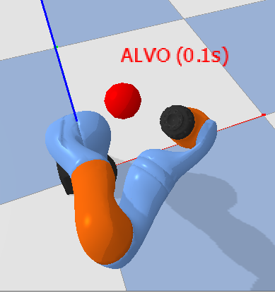
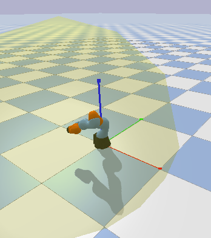
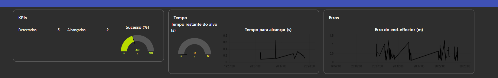
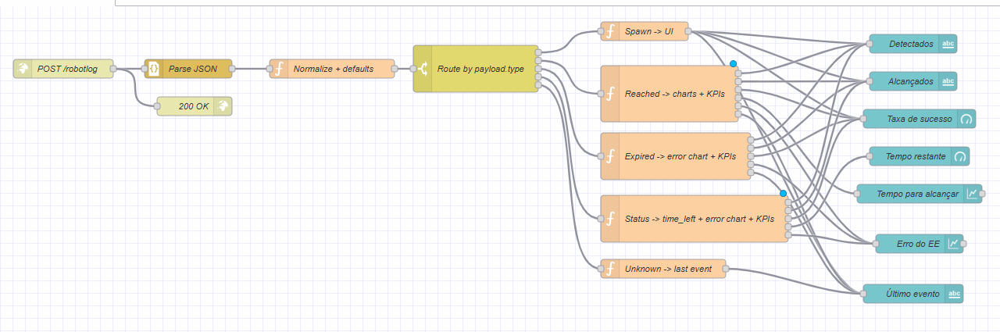
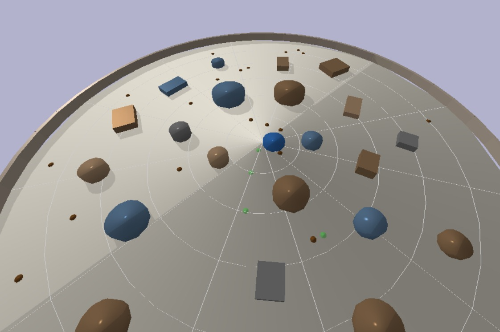
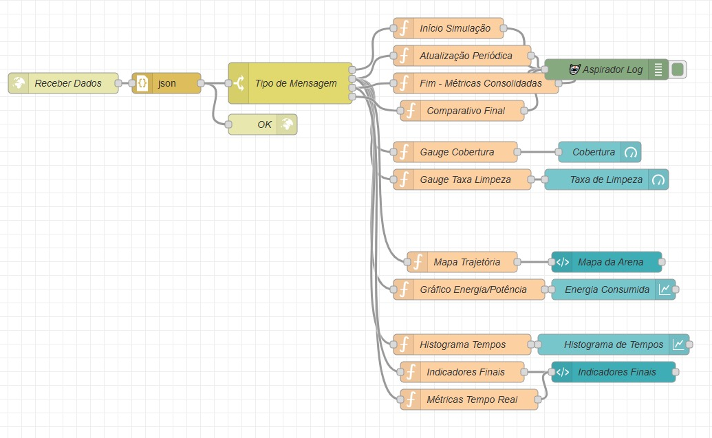

# 🤖 Simulação de Robôs com PyBullet e Node-RED

Trabalho acadêmico de Robótica contendo dois projetos de simulação: um **manipulador planar 6-DOF** e um **robô aspirador autônomo**. Ambos utilizam PyBullet para física e Node-RED para supervisão.

---

## 📋 Índice

- [Visão Geral](#visão-geral)
- [Projeto 1: Manipulador Planar 6](#-manipulador-planar-2-dof)
- [Projeto 2: Robô Aspirador](#-robô-aspirador-autônomo)
- [Instalação](#instalação)
- [Node-RED](#configuração-node-red)

---

## Visão Geral

| Projeto | Tipo | Controle | Sensores |
|---------|------|----------|----------|
| **Manipulador Planar** | Braço articulado 6-DOF | PID por junta | Encoder, torque |
| **Robô Aspirador** | Móvel diferencial | Navegação reativa | 5x ultrassônico |

---

## 🦾 Manipulador Planar 6-DOF

Simulação de um braço robótico 6-DOF (KUKA IIWA) que detecta e alcança alvos aleatórios usando controle PID por junta e cinemática inversa.

### Funcionalidades

| Funcionalidade | Descrição |
|----------------|-----------|
| Cinemática Inversa | Calcula ângulos para posição desejada |
| Controle PID | Malha fechada por torque em cada junta |
| Detecção de Alvos | Sensor de presença para detectar alvos |
| Geração Aleatória | Alvos gerados aleatoriamente no workspace |
| Visualização | Interface gráfica com marcadores visuais |

### Visualizações do Projeto

#### Braço Robótico em Ação


#### Sensor de Aproximação


#### Dashboard Node-RED


#### Configuração Node-RED


### Execução

```bash
cd braco6
pip install -r requirements.txt
python main.py
```

### Estrutura

```
braco6/
├── main.py              # Script principal
├── requirements.txt     # Dependências
└── ...
```

---

## 🧹 Robô Aspirador Autônomo

Simulação de um robô aspirador autônomo que navega pelo ambiente, aspira sujeiras e desvia de obstáculos enquanto mapeia o ambiente em tempo real.

### Robô Aspirador em Ação


### Funcionalidades

| Funcionalidade | Descrição |
|----------------|-----------|
| Navegação Autônoma | Varredura sistemática (boustrophedon) |
| Aspiração de Sujeiras | Detecção e coleta automática de objetos |
| Evasão de Obstáculos | 5 sensores ultrassônicos para evitar colisões |
| Mapeamento 2D | Grid de ocupação construído em tempo real |
| Aprendizado | Usa mapa anterior para otimizar rotas |

### Visualizações do Projeto

#### Desempenho Final


#### Mapa da Trajetória


#### Gráficos de Performance


#### Dashboard Node-RED


### Comportamento de Aprendizado

| Execução | Comportamento |
|----------|---------------|
| 1ª | Exploração completa, cria mapa |
| 2ª | Usa mapa salvo, evita áreas já limpas |
| 3ª+ | Otimização refinada |

### Métricas

| Métrica | Objetivo |
|---------|----------|
| Cobertura (%) | Maximizar |
| Tempo | Minimizar |
| Energia (J) | Minimizar |
| Colisões | Minimizar |

### Execução

```bash
cd robo-aspirador
python main.py
```

| Argumento | Descrição | Padrão |
|-----------|-----------|--------|
| `--executions` | Número de execuções | 3 |
| `--time` | Tempo máximo (s) | 90 |
| `--no-gui` | Sem interface | False |

### Estrutura

```
robo-aspirador/
├── main.py                # Script principal
├── node_red_flow.json     # Flow Node-RED
├── src/
│   ├── robot.py           # Classe do robô
│   ├── environment.py     # Ambiente PyBullet
│   ├── mapping.py         # Mapa de ocupação
│   ├── controller.py      # Navegação
│   ├── dirt_manager.py    # Gerenciamento de sujeiras
│   └── node_red_client.py # Cliente HTTP
├── models/                # URDFs
└── saved_maps/            # Mapas entre execuções
```

---

## Instalação

```bash
# Clonar repositório
git clone https://github.com/JoaoLCardozo/ProjetoRobotica.git
cd ProjetoRobotica

# Instalar dependências
pip install -r requirements.txt
```

---

## Configuração Node-RED

```bash
# Instalar Node-RED
npm install -g node-red

# Iniciar
node-red
```

1. Acesse `http://localhost:1880`
2. Menu ☰ → Import → selecione `node_red_flow.json`
3. Deploy
4. Dashboard em `http://localhost:1880/ui`

---

## ✅ Requisitos Atendidos

### Manipulador
- ✅ Manipulador planar 2-DOF
- ✅ Controle PID por junta
- ✅ Cinemática direta/inversa
- ✅ Desvio de obstáculos
- ✅ Pick-and-place
- ✅ Supervisão Node-RED

### Aspirador
- ✅ Robô móvel diferencial
- ✅ 5 sensores ultrassônicos
- ✅ Exploração autônoma
- ✅ Mapeamento de ocupação
- ✅ Aprendizado por repetição
- ✅ Supervisão Node-RED

---

## 👥 Autores

- **Igor Gabriel Silva Gusmão**
- **João Luiz Ferreira Cardozo** - [@JoaoLCardozo](https://github.com/JoaoLCardozo)

